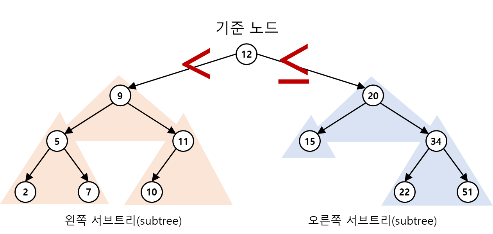

# 과제#8 이진탐색트리 구현

- 이진탐색트리 클래스를 Python 프로그래밍 언어로 구현해 보는 과제입니다.
- 이진탐색트리의 개념도 중요하지만, 이번 실습을 통해 프로그래밍 실력을 향상시켜 봅시다.
- 이진탐색트리의 구현을 이해하기 위해 [VisuAlgo](https://visualgo.net/en)를 참고할 수 있습니다.
- 모든 코드는 `binarysearchtree.py` 파일에 작성하며, 파일명을 변경하면 안 됩니다.
- 특정 멤버함수들의 경우 다른 멤버함수가 완벽하게 구현되어야 테스트가 가능합니다.
- 제출 기한은 **2025년 6월 10일 오후 11시 59분** 입니다.
- `binarysearchtree.py`의 코드 템플릿은 아래와 같습니다.


```Python
class `Node`:
    def __init__(self,
                 data=None,
                 left=None,
                 right=None,
                 parent=None):

        pass
        
    def __str__(self):
        return "`Node`({})".format(self.data)
    
    def __repr__(self):
        return str(self)

    def count_children(self):
        pass
    
    def children(self):
        pass
 

class BinarySearchTree:
    def __init__(self):
        pass
    
    def __len__(self):
        pass
    
    def empty(self):
        pass
    
    def insert(self, data):        
        pass
    
    def inorder(self, get_node=False):
        pass
    
    def preorder(self, get_node=False):
        pass
    
    def postorder(self, get_node=False):
        pass
    
    def min(self, root=None, get_node=False):
        pass
    
    def max(self, root=None, get_node=False):
        pass       
        
    def search(self, data):
        pass

    def remove(self, data):
        pass
    
    def clear(self):
        pass
```

 
## 문제(1)	``Node`` 클래스 작성 [10점]
- `Node` 클래스는 `_data`, `_left`, `_right`, `_parent`를 멤버변수(member variable)로 갖는다.
    - `_data`, `_left`, `_right`, `_parent` 멤버변수의 값은 파이썬 프로퍼티(property)를 통해 읽어오고 변경할 수 있어야 한다.
    - `Node` 클래스의 `__init__`에서 각 멤버변수를 생성한다.
    - `@property`를 통해 각 멤버변수의 값을 읽어올 수 있도록 구현한다.
    - `@<프로퍼티이름>.setter`를 통해 각 멤버변수의 값을 설정할 수 있도록 구현한다.
- `Node` 클래스는 `count_children()`을 멤버함수(member function)로 갖는다.
    - `count_children()`은 자식 노드의 개수를 반환한다.
- `Node` 클래스는 `children()`을 멤버함수로 갖는다. 
    - `children()`은 `None`이 아닌 자식 노드들에 대한 참조를 `list`로 반환한다.
    - 자식 노드가 두 개인 경우 두 자식 노드를 포함하는 `list`를 반환한다 (즉, `[self._left, self._right]`를 반환).
    - 자식 노드가 하나만 있는 경우 (즉, `_left` 또는 `_right`는 `None`인 경우), `None`이 아닌 노드만 임시 `list`에 추가하여 반환한다.
    - 만약 자식 노드가 없는 경우 비어있는 `list`를 반환한다.


## 문제(2)	`BinarySearchTree` 클래스 작성 [10점] 
- `BinarySearchTree` 클래스는 `_root` 및 `_num_nodes`를 멤버변수로 갖는다. 
- `BinarySearchTree`의 멤버변수는 객체 내부에서만 사용하므로 프로퍼티를 정의할 필요는 없다.
- `BinarySearchTree` 클래스의 `__init__`에서 `_root` 및 `_num_nodes` 멤버변수 생성한다.

## 문제(3)	`BinarySearchTree` 클래스의 `__len__` 멤버함수 구현 [5점]
- 트리에 존재하는 모든 노드의 개수를 반환한다.
- `_num_nodes`를 이용하여 구현한다.

## 문제(4)	`BinarySearchTree` 클래스의 `empty` 멤버함수 구현 [5점]
- 트리에 노드가 전혀 없으면 `True`를 반환하고, 그렇지 않으면 `False`를 반환한다.
- `_num_nodes`를 이용하여 구현한다.


## 문제(5)	`BinarySearchTree` 클래스의 `insert` 멤버함수 구현 [5점]
- `data`로 지정한 객체를 이진탐색트리에 추가하는 멤버함수이다.
- `data`는 파이썬에 있는 모든 객체가 될 수 있으며, 비교 연산이 가능해야 한다.
- 이진탐색트리의 각 노드는 자신의 왼쪽 서브트리에 있는 모든 노드보다 데이터의 값이 크고, 자신의 오른쪽 서브트리에 있는 모든 노드보다 데이터의 값이 같거나 작다.

<p align="center">
  
</p>


## 문제(6)	`BinarySearchTree` 클래스의 순회(traversal) 멤버함수 구현 [15점]
### (a) 전위순회 `preorder(get_node=False)` 멤버함수 구현 [5점]
### (b) 중위순회 `inorder(get_node=False)` 멤버함수 구현 [5점]
### (c) 후위순회 `postorder(get_node=False)` 멤버함수 구현 [5점]

- 순회 방식에 따라 노드를 방문하면서 리스트에 데이터 또는 노드 객체를 담아 반환한다.
- `get_node` 매개변수의 기본값은 `False`이며, `get_node`가 `True`이면 반환할 리스트에 데이터 대신 노드 객체를 담는다.
- 각 순회 함수는 재귀 함수로 구현할 수 있다. 하지만 재귀 함수를 사용하지 않고 while 루프와 큐 또는 스택 자료구조를 적절히 활용하여 구현할 것을 권장한다.


## 문제(7)	`BinarySearchTree` 클래스의 최대/최소 멤버함수 구현 [10점]
### (a) `min(root, get_node=False)` 멤버함수 구현 [5점]
### (b) `max(root, get_node=False)` 멤버함수 구현 [5점]
- 이진탐색트리에서 데이터의 값이 최소/최대인 노드를 찾아 데이터 또는 노드를 반환한다.
- `get_node` 매개변수의 기본값은 `False`이며, `get_node`가 `True`이면 데이터 대신 노드를 반환한다.
- `root` 매개변수에 특정 노드를 넣어주면 해당 노드를 루트로 하여 서브트리에서 최소/최대값을 찾는다.


## 문제(8)	`BinarySearchTree` 클래스의 `search(data)` 멤버함수 구현 [10점]
- 지정한 `data`를 갖는 `Node` 객체를 찾아 반환한다.
- 트리에 지정한 `data`가 없는 경우 `None`을 반환한다.
- `BinarySearchTree`가 비어있는 상황에서 `search()` 멤버함수를 호출한 경우, `IndexError` 예외를 발생시킨다.


## 문제(9)	`BinarySearchTree` 클래스의 `remove(data)` 멤버함수 구현 [20점]
- 지정한 `data`를 갖는 `Node` 객체를 찾아 트리에서 떼어내고, 트리에서 떼어낸 `Node` 객체는 반환한다.
- 트리가 비어 있는 상황에서 `remove()` 멤버함수를 호출한 경우, 예외를 발생시키지 말고, 객체가 아무것도 하지 않도록 작성한다.
- 삭제해야 될 노드가 왼쪽/오른쪽 자식 노드를 모두 갖고 있는 경우, 삭제 노드의 오른쪽 서브트리에서 최소값을 갖는 노드를 찾아 대체 노드로 삼는다. 대체 노드를 찾을 때 `min()` 멤버함수를 활용할 것을 권한다.

<p align="center">
  
</p>


## 문제(10)	`BinarySearchTree` 클래스의 `clear()` 멤버함수 구현 [10점]
- `BinarySearchTree` 내에 있는 모든 `Node` 객체를 제거하는 함수이다.
- 각 `Node` 객체를 참조하는 변수가 하나도 없도록 코드를 작성한다. 즉, 가비지 콜렉션(garbage collection)에 따라 `Node` 객체가 자동적으로 삭제될 수 있도록 한다.
- `_num_nodes`를 이용하여 구현하며, 노드가 전혀 없는 경우 `True`를 반환하고 그렇지 않은 경우 False를 반환한다.
- 후위순회(postorder traversal)하면서 각 노드에 `left, right, parent`에 `None`을 삽입한 후, 마지막으로 `_root`를 `None`으로 설정하고 `_num_nodes`에 0을 대입한다.

